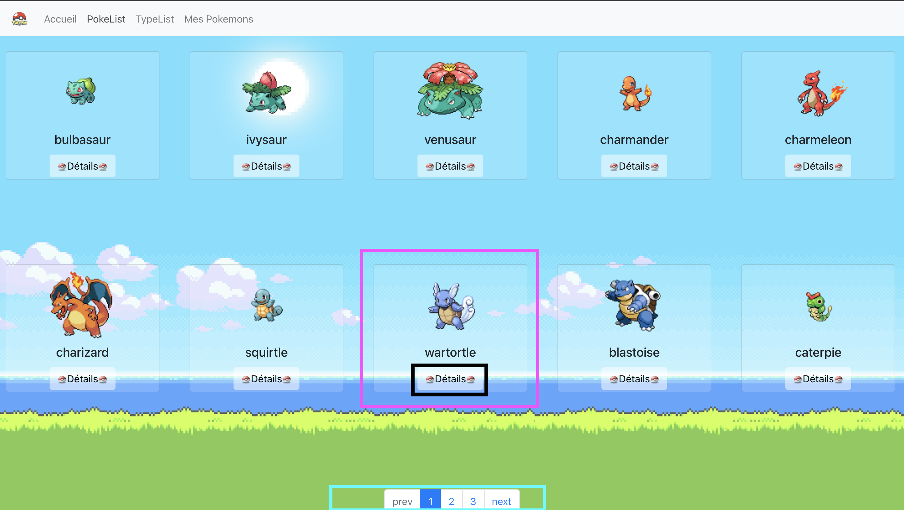
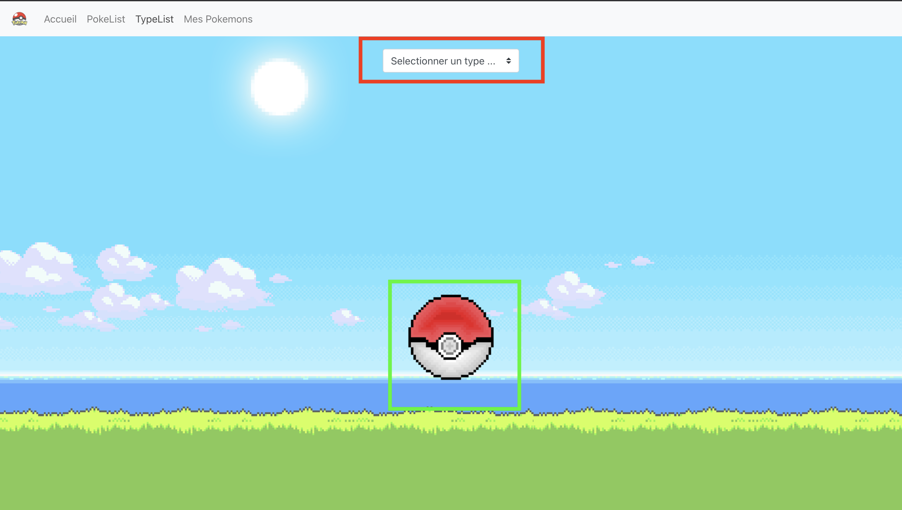
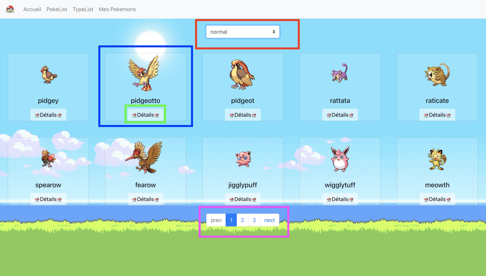
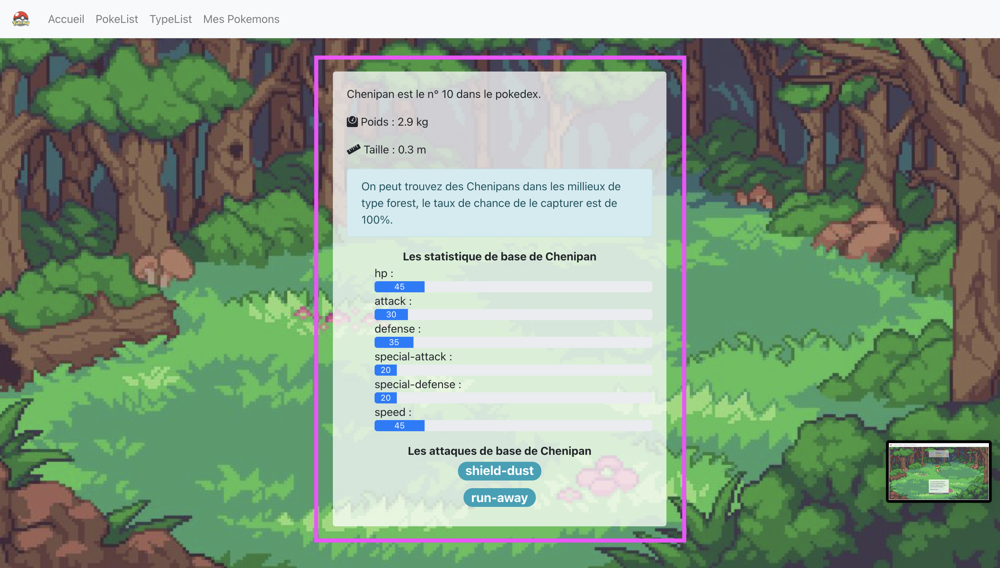
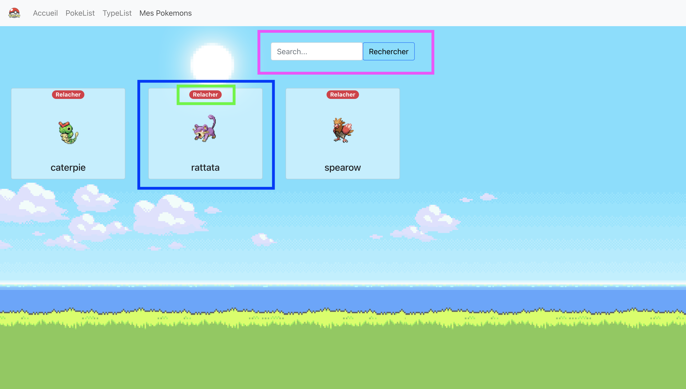

# Projet 1 : Pokeapi

## URL : pokeapi.co

### Fonctionnalités attendues

- [ x ] Homepage : zoom sur un pokemon, vous affichez le détail d'un pokemon choisi aléatoirement dans l'API.

- [ x ] Recherche paginée de la liste de tous les pokemons

- [ x ] Recherche par type (liste paginée en fonction du nombre de résultat)

- [ x ] Détail d'un pokemon au clic sur un des résultats de recherche (choisissez quelques éléments importants à afficher, dont au moins une image)

- [ x ] Fonction de gestion de "favoris" de Pokemon (ajout/retrait/consultation/filtrage dans la liste des favoris)


### Fonctionnalités++

- [ o ] Historique des recherches par type

- [ x ] Caroussel d'image pour la page de détail
...

# Lancement du projet
## Pré-requis
- React js

## Mise en place

- Une fois dans le projet effectuer la commande 
```
yarn install
```
- Après que les dépendances soient ajoutées au projet
````
yarn start
````
# l'organisation de mon projet
## logique d'organisation des composants
### Dossier Api
Dans le dossier Api, il y a le fichier client.js qui sert à traiter les requêtes qui seront envoyées et récus. 
### Dossier App
Le dossier App, contient notre store. Ce store sert a referencer nos différentes slices qui seront utilisées.
### Dossier Assets
Ce dossier va servir pour stocker toutes les images dont nous auront besoin pour le projet.
### Dossier features
#### Sous-dossier Navigation
Le dossier Navigation contient :
- un fichier qui sert à créer la navigation entre les différentes pages du site.
- un dossier styles qui va contenir le style pour le fichier navigation.js
#### Sous-dossier Redux
Le dossier Redux, va servir pour stocker les différents reducers. Pour cela j'ai créé un fichier par page vu que chaque page effectue des actions propre à elle.
On peut donc retrouver :
- AllPokemonSlice qui servira à effectuer des requêtes vers l'api pour récupérer tous les pokemons
- DetailsPokemonSlice qui se charge de gérer les requêtes pour récupérer les details d'un pokemon
- FavoriePokemonSlice qui elle n'effectue aucune requête, mais elle va gérer le stockage d'un pokemon dans une liste de favorie
- PaginationPokemonSlice récupère via une requête les pokemon en fonction de la page souhaitée
- RandomPokemonSlice récupère via l'api les données d'un pokemon aléatoire
#### Sous-dossier Pages
Le dossier page va contenir les différentes page qui compose notre site.
Chaque dossier d'une page contient la page et ses composants ainsi qu'un dossier styles qui contient un fichier par composant pour gérer son style.

### Organisation du travail sur le dépot (commits, branches, ...)
#### Branches
- Branche-Fonctionalité :
    - Lorsque je devais ajouter une fonctionalité je créais une branche dédié a celle là
- Develop
    - La branche develop va recevoir les diverses branche-Fonctionalité quand celle-ci sont terminé
- Master 
    - La branche master va recevoir le projet lorsqu'il doit etre mis en production

### Les pistes d'organisation que vous avez identifié sur le code et sur le dépot.
On peut ajouter une convention des commits et une convention pour les branches.
J'ai aussi constater que sur github , il y a possibilité d'avoir un mini repo juste pour le readme ou les images utilisé pour seront stockées dans un dossier fait exprès.


# Les fonctionalités
## Spinner
- Quand les requetes sont en cours d'envoie un spinner est présent


## Homepage
- en bleu : description rapide d'un pokemon random
- en rouge : selection d'un autre pokemon random


## Liste tous les pokemons
- en rose : Carte d'un pokemon 
- en noir : accès au details du pokemon
- en rouge : Pagination pour parcourir la liste des pokemon


## Liste tous les pokemons par type
### Cas 1
- Ici vu qu'on a aucun type de pokemon selectionné, l'icone de la pokeball est présente 
- en rouge : selection d'un type
- en vert : Chargement de la page


### Cas 2
- Ici vu qu'on a un type de pokemon selectionné, la liste est présente
- en rouge : selection d'un type 
- en bleu : carte d'un pokemon ayant le type selectionné
- en vert : accès au details du pokemon
- en rose : pagination pour parcourir la liste du type selectionné


## Détails d'un pokemon
### Front
- en bleu : Carte du pokemon 
- en bordeau : Ajout aux favoris (capturer = ajouter / relacher = supprimer)
- en orange : slider des images du pokemon dans la base de donnée
- en vert : acces a plus d'information sur le pokemon


### Back
- en rose : details du pokemon, zone cliquable pour retourner sur l'autre coté de la carte


## Les favories
- en rose : filtrage en fonction du nom du pokemon
- en bleu : pokemon capturer
- en vert : relacher le pokemon (l'enlever des favoris)

